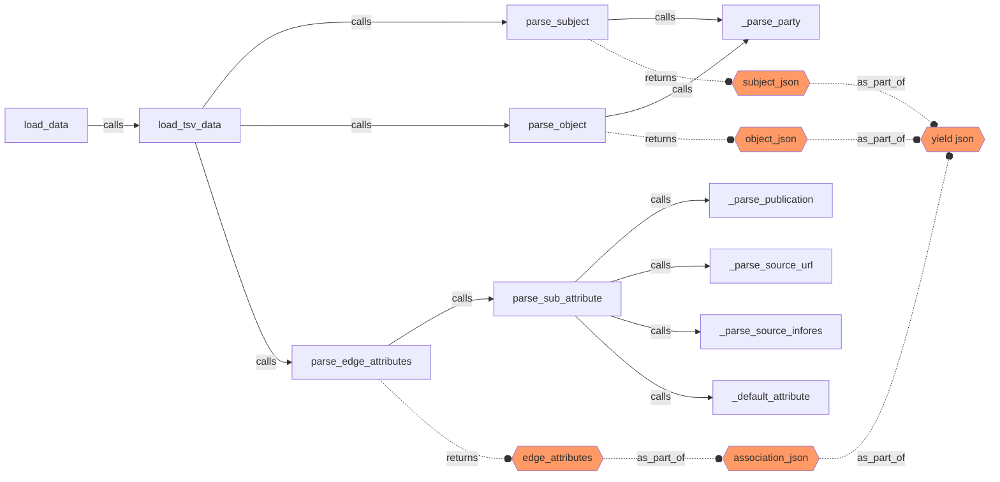

The structure of the parser is illustrated below (edited by @erikyao)

```mermaid
flowchart LR
   LD["load_data"]
   LTD["load_tsv_data"]
   
   PS["parse_subject"]
   PO["parse_object"]
   PP["_parse_party"]
   
   PEA["parse_edge_attributes"]
   PSA["parse_sub_attribute"]
   PSA_PP["_parse_publication"]
   PSA_PSU["_parse_source_url"]
   PSA_PSI["_parse_source_infores"]
   PSA_DA["_default_attribute"]

   classDef instance fill:#f96;
   EA{{"edge_attributes"}}:::instance
   SJ{{"subject_json"}}:::instance
   OJ{{"object_json"}}:::instance
   AJ{{"association_json"}}:::instance
   YJ{{"yield json"}}:::instance

   LD -- calls --> LTD
   LTD -- calls --> PS -- calls --> PP
   PS -. returns .-o SJ
   LTD -- calls --> PO -- calls --> PP
   PO -. returns .-o OJ

   LTD -- calls --> PEA -- calls --> PSA
   PSA -- calls --> PSA_PP
   PSA -- calls --> PSA_PSU
   PSA -- calls --> PSA_PSI
   PSA -- calls --> PSA_DA

   PEA -. returns .-o EA -. as_part_of .-o AJ

   SJ -. as_part_of .-o YJ
   OJ -. as_part_of .-o YJ
   AJ -. as_part_of .-o YJ
```